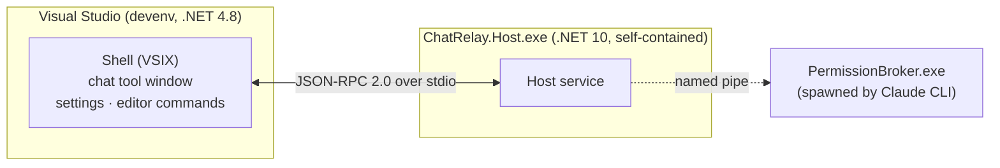
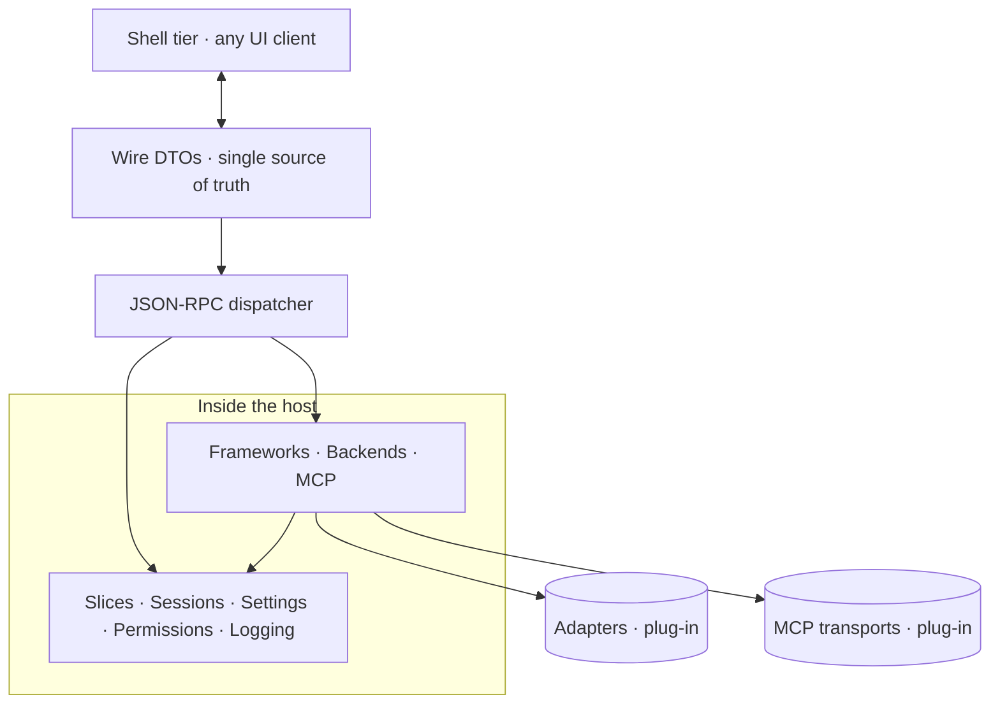
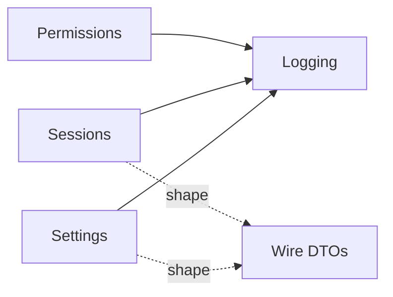
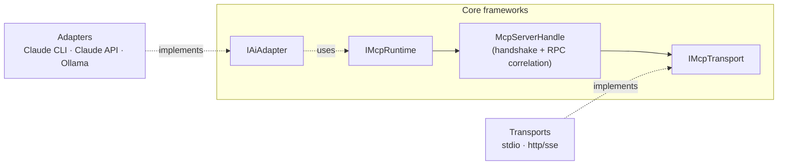
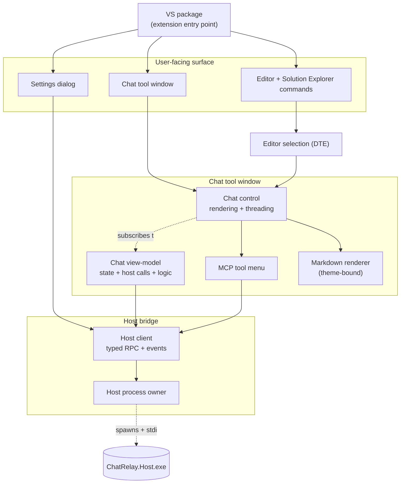
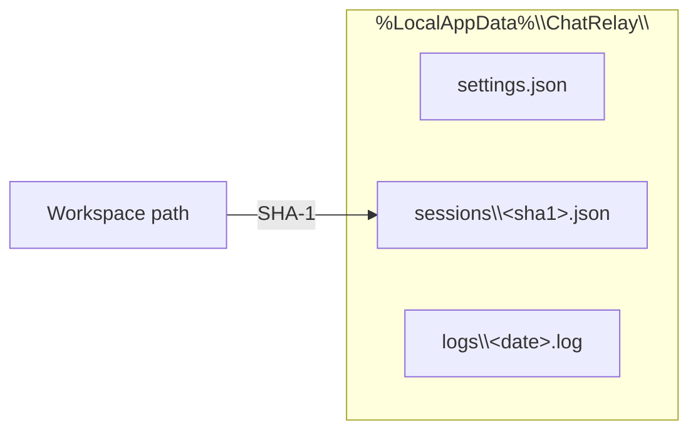
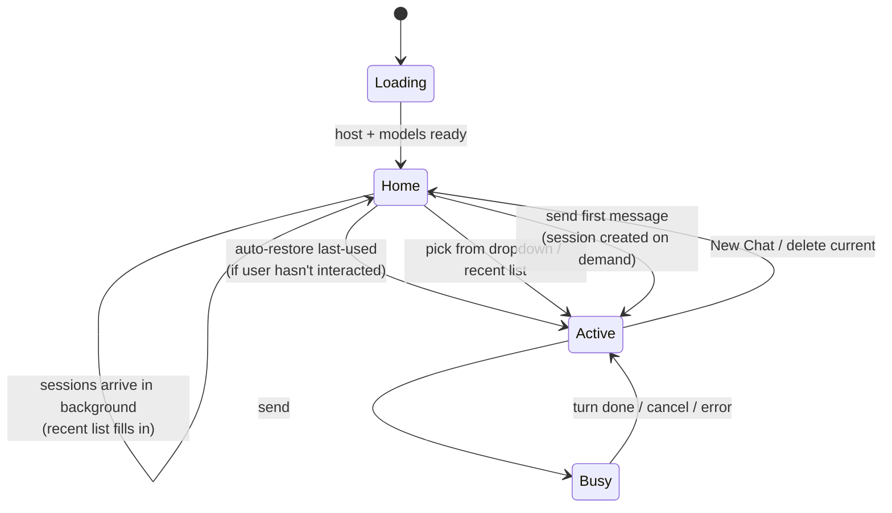
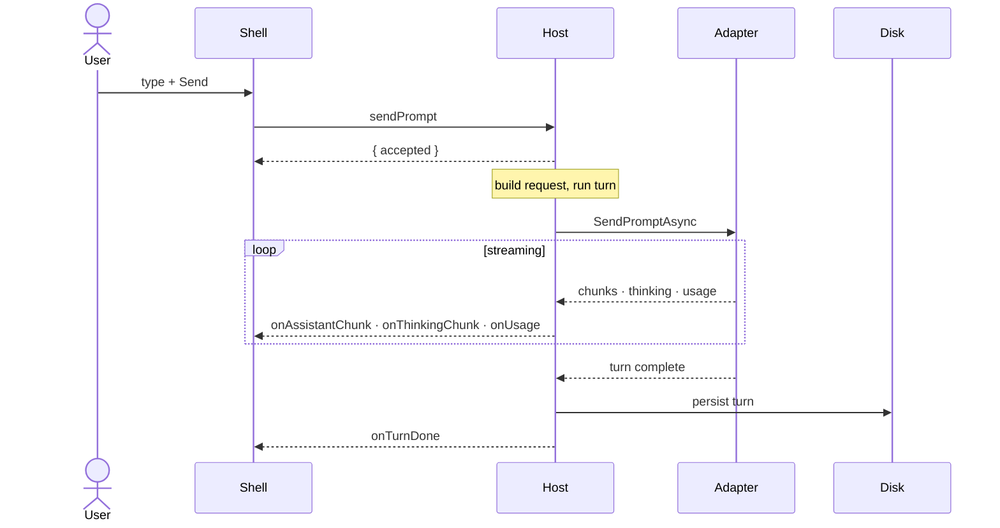

# ChatRelay Architecture

Wire contract: [PROTOCOL.md](PROTOCOL.md). Recent changes: [CHANGELOG.md](CHANGELOG.md). End-user features: [README.md](README.md).

---

## 1. Two processes

VS hosts the VSIX in-proc on net48; everything else runs in a child net10 process. The shell has zero references to host-side code — the protocol is the only seam.

---

## 2. Layers

Wire DTOs live in one assembly referenced by both shell and host. The dispatcher routes calls to either a framework or a feature slice. Adapters and transports plug in without touching the rest.

---

## 3. Slices

Each slice is its own folder/project — open one to see everything that concept does.

| Slice | Owns |
|-------|------|
| Logging | daily-file logger |
| Settings | `settings.json` load · save · migrate |
| Sessions | per-workspace chat persistence + reference items |
| Permissions | named-pipe server for CLI tool approvals |

Slices share the namespace with their wire DTOs — different assembly, no friction at the call site.

---

## 4. Adapters & MCP

Two extension seams: a new AI implements `IAiAdapter`; a new MCP transport implements `IMcpTransport` and is added to the transport switch. Neither path touches anything else.

---

## 5. Shell internals

Pure UI. Every data round-trip goes through `HostClient`. The VSIX has zero references to Core or to any slice — only the wire DTOs.

---

## 6. Persistence

All writes are atomic (tmp + rename); all reads tolerate missing files. Same canonical workspace path → same chats across any future IDE shell.

---

## 7. Chat states

Sessions only exist on disk once they've had at least one user/assistant turn — empty placeholders are filtered server-side. The loading overlay drops as soon as host + models are ready; the session list arrives shortly after via a background fetch. Bubble headers carry the actual model + timestamp persisted with each turn.

---

## 8. Sending a prompt

Cancellation flows the other way (`cancelTurn`). Permission requests interrupt this flow with an `onPermissionRequest` notification → `respondPermission` reply round-trip.

---

## 9. Where to look

| Looking for | Start at |
|-------------|----------|
| Wire format | `PROTOCOL.md` |
| Wire DTOs | `ChatRelay.Contracts/Protocol.cs` |
| Settings shape | `ChatRelay.Contracts/Settings.cs` |
| Adapter contract | `ChatRelay.Core/Backends/IAiAdapter.cs` |
| MCP runtime | `ChatRelay.Core/Mcp/IMcpRuntime.cs` |
| MCP transport contract | `ChatRelay.Core/Mcp/IMcpTransport.cs` |
| MCP transport selector | `ChatRelay.Core/Mcp/McpTransports.cs` |
| Sessions persistence | `ChatRelay.Sessions/SessionStore.cs` |
| Settings persistence | `ChatRelay.Settings/SettingsStore.cs` |
| JSON-RPC method handlers | `ChatRelay.Host/HostService.cs` |
| Chat state + logic | `ChatRelay.VisualStudio/Chat/ChatViewModel.cs` |
| Chat rendering | `ChatRelay.VisualStudio/Chat/ChatControl.xaml.cs` |
| Settings dialog | `ChatRelay.VisualStudio/Settings/SettingsWindow.xaml.cs` |
| Logs on disk | `%LocalAppData%\ChatRelay\logs\` |
| Sessions on disk | `%LocalAppData%\ChatRelay\sessions\` |
| Settings on disk | `%LocalAppData%\ChatRelay\settings.json` |
